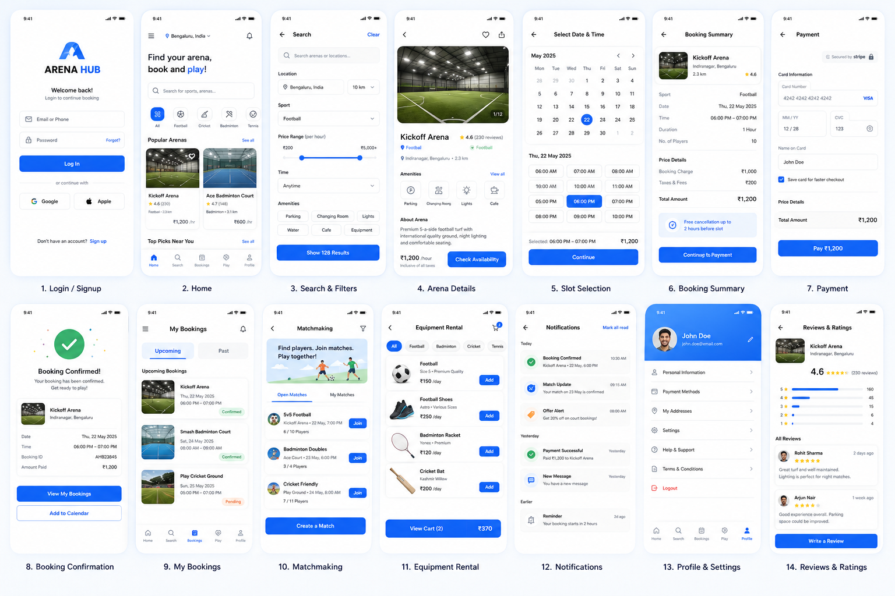
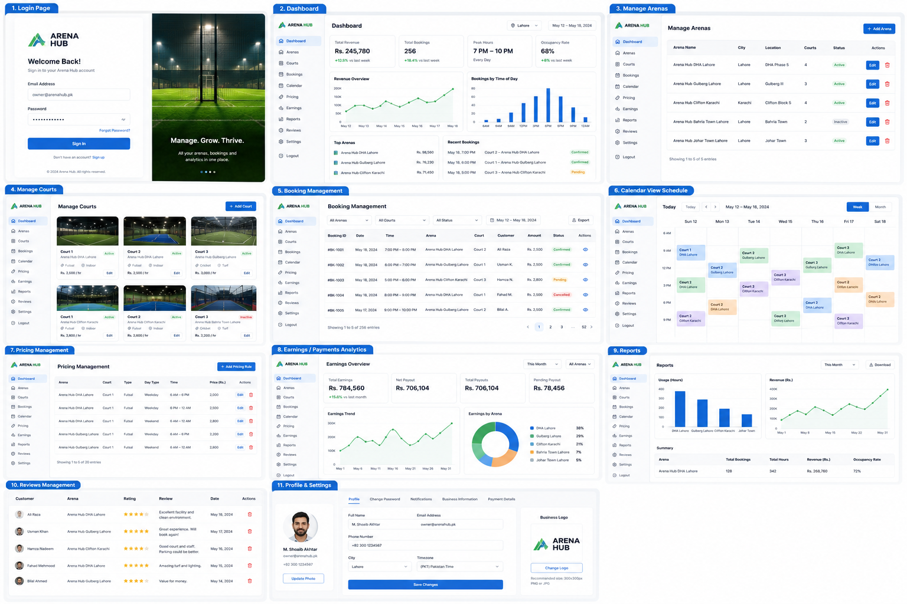
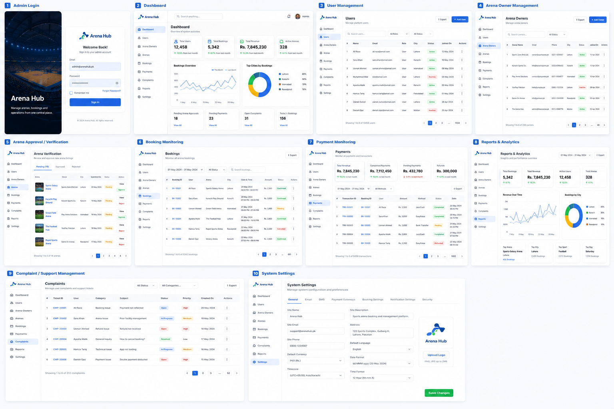

<div align="center">

# 🏟️ ArenaHub

### Sports Arena Booking &amp; Management Platform for Pakistan

<!-- To add a custom banner: drop it at docs/images/banner.png and embed it here. -->

[](https://github.com/abubakar-51215/ArenaHub/actions/workflows/backend.yml)
[](https://github.com/abubakar-51215/ArenaHub/actions/workflows/frontend.yml)


<p>
&nbsp;&nbsp;
&nbsp;&nbsp;
&nbsp;&nbsp;
&nbsp;&nbsp;
&nbsp;&nbsp;
&nbsp;&nbsp;
&nbsp;&nbsp;

</p>

**🚧 Status: In active development — Sprint 2 (Authentication)**

</div>

---

## 📑 Table of Contents

- [Overview](#-overview)
- [Features](#-features)
- [Tech Stack](#-tech-stack)
- [Architecture](#-architecture)
- [Project Structure](#-project-structure)
- [Design (Wireframes)](#-design-wireframes)
- [Getting Started](#-getting-started)
- [Task Runner](#-task-runner)
- [Roadmap](#-roadmap)
- [Git Workflow](#-git-workflow)
- [Team](#-team)
- [License](#-license)

---

## 📖 Overview

**ArenaHub** is a centralized sports-arena booking and management platform for
Pakistan, replacing the manual phone/WhatsApp/register booking process with a
real-time digital system.

- **Players** discover nearby facilities, view live slot availability, book and
  pay securely, and manage their reservations through a **React Native mobile
  app**.
- **Arena Owners** register arenas, manage courts, pricing, bookings, payments,
  equipment, and reports through a **Next.js web dashboard**.
- **Administrators** verify arenas, monitor bookings and payments, handle
  complaints, and view platform-wide analytics through a dedicated dashboard.

Developed as a two-person **Final Year Project** on an 18-week / 5-sprint plan.
The full specification lives in [`docs/`](docs/); the authoritative rulebook is
[`docs/PROJECT_GUIDELINES.md`](docs/PROJECT_GUIDELINES.md) (it wins on any
conflict), and the execution plan is
[`MASTER_DEVELOPMENT_PLAN.md`](MASTER_DEVELOPMENT_PLAN.md).

---

## ✨ Features

- 🔍 **Arena Search** — text, filters, and natural-language (NLP) queries
- 📍 **OpenStreetMap Integration** — nearby arenas + distance (Haversine)
- 📅 **Real-Time Booking** — live slot availability over WebSockets
- 🔒 **Redis Distributed Locking** — prevents double bookings
- 💳 **Online Payments** — card (Stripe), JazzCash, EasyPaisa &amp; bank transfer
- 🔐 **JWT Authentication** — access + refresh with rotation &amp; replay detection
- 👥 **Role-Based Access Control** — Player, Owner, Admin
- 📱 **React Native Mobile App** (Expo)
- 💻 **Next.js Web Dashboards** — Owner &amp; Admin
- 🎟️ **Equipment Rental &amp; QR Check-in**
- ⭐ **Reviews &amp; Ratings**
- 📊 **Downloadable Reports &amp; Analytics** (PDF / CSV)
- 🤖 **AI Recommendations** — content-based arena suggestions

---

## 🧰 Tech Stack

| Layer | Technology |
|---|---|
| 📱 Mobile | React Native + **Expo SDK 54**, TypeScript |
| 💻 Web | **Next.js 15** (App Router), React 19, Tailwind CSS 4, shadcn/ui |
| ⚙️ Backend | **FastAPI**, async SQLAlchemy 2, Pydantic 2 |
| 🐍 Language | **Python 3.12** |
| 🗄️ Database | **PostgreSQL 18** |
| ⚡ Cache / Locking | **Redis** (Memurai on Windows) |
| 🧠 State | Zustand + TanStack Query |
| 🗺️ Maps | OpenStreetMap + Leaflet / react-native-maps |
| 🔄 Migrations | Alembic |
| ⏱️ Background Jobs | FastAPI BackgroundTasks + APScheduler |
| 📦 Package Managers | **uv** (backend) · npm (frontend) |
| 🪵 Logging | structlog |

> **No Docker until the final sprint** — local dev runs against natively
> installed PostgreSQL, Memurai, a uv-managed Python venv, and the JS dev
> servers directly (see PROJECT_GUIDELINES.md deviation #1).

---

## 🧱 Architecture

```text
        ┌──────────────────────┐        ┌──────────────────────────┐
        │   Player Mobile App  │        │      Web Dashboard       │
        │  React Native / Expo │        │  Next.js (Owner + Admin) │
        └───────────┬──────────┘        └────────────┬─────────────┘
                    │        HTTPS · REST · WebSocket │
                    └───────────────┬─────────────────┘
                                    ▼
                        ┌───────────────────────┐
                        │      FastAPI  API      │
                        │  feature-based modules │
                        └──────┬─────────┬───────┘
                               │         │
                   ┌───────────┘         └───────────┐
                   ▼                                 ▼
          ┌──────────────────┐              ┌──────────────────┐
          │    PostgreSQL    │              │      Redis       │
          │  ACID data store │              │  locks + caching │
          └──────────────────┘              └──────────────────┘

   External: Stripe · JazzCash · EasyPaisa · Cloudinary · FCM · SMTP
```

---

## 📂 Project Structure

```text
ArenaHub/
├── backend/                 # FastAPI + async SQLAlchemy + Alembic
│   ├── app/
│   │   ├── modules/         # feature modules: auth, user, arena, court, health …
│   │   │                    #   each owns api / service / repository / schema / model
│   │   ├── core/            # config, logging, exceptions, handlers
│   │   ├── database/        # engine, session, base, mixins
│   │   ├── shared/          # response envelope, cross-cutting helpers
│   │   ├── cache/           # Redis client
│   │   └── main.py
│   └── alembic/             # migrations
├── frontend/
│   ├── mobile/              # Expo (React Native) app
│   └── web/                 # Next.js (Owner + Admin) dashboard
├── docs/                    # 15 spec files, ADRs, PROJECT_GUIDELINES, DEVELOPMENT_LOG
├── design/wireframes/       # UI mockups (Users / ArenaOwners / Admin)
├── .github/workflows/       # backend + frontend CI
├── MASTER_DEVELOPMENT_PLAN.md
└── README.md
```

---

## 🎨 Design (Wireframes)

| Player (Mobile) | Arena Owner (Web) | Admin (Web) |
|:---:|:---:|:---:|
|  |  |  |

> Interfaces are built to match these wireframes. Live screenshots will replace
> them as each dashboard ships.

---

## 🚀 Getting Started

### Prerequisites

Install and have running before you start:

- **PostgreSQL 18** — on `localhost:5432`
- **Memurai** (Windows-native Redis) — on `localhost:6379`
- **uv** — `winget install --id=astral-sh.uv` (manages the pinned Python 3.12; no global Python needed)
- **Node.js 20 LTS** and npm
- **Git**

### 1. Clone

```bash
git clone https://github.com/abubakar-51215/ArenaHub.git
cd ArenaHub
npm install            # root task-runner scripts + pre-commit tooling
```

### 2. Backend (FastAPI)

```bash
cd backend
cp .env.example .env   # then fill in real values
uv sync                # creates .venv from pyproject.toml, installs deps
uv run alembic upgrade head
uv run uvicorn app.main:app --reload
```

Backend runs at `http://localhost:8000` · OpenAPI docs at `/docs` · health check
at `/api/v1/health`.

### 3. Web (Next.js)

```bash
cd frontend/web
npm install
cp .env.example .env    # set NEXT_PUBLIC_API_URL
npm run dev             # http://localhost:3000
```

### 4. Mobile (Expo)

```bash
cd frontend/mobile
npm install
cp .env.example .env    # set EXPO_PUBLIC_API_URL
npx expo start
```

---

## 🏃 Task Runner

Cross-platform npm scripts from the repo root (no Makefile needed on Windows):

| Command | Does |
|---|---|
| `npm run dev` | Start backend + web dev servers together |
| `npm run dev:backend` | Backend only (`uv run uvicorn … --reload`) |
| `npm run dev:web` | Next.js dev server |
| `npm run dev:mobile` | Expo dev server |
| `npm run migrate` | `alembic upgrade head` |
| `npm run makemigration` | Create a new Alembic revision (autogenerate) |
| `npm run seed` | Seed reference data (amenities, etc.) |
| `npm run test` | Backend pytest suite |
| `npm run lint` | ruff + eslint |
| `npm run format` | black + prettier |

---

## 🧭 Roadmap

| Sprint | Focus | Status |
|---|---|:---:|
| **Sprint 1** | Scaffold — backend, mobile, web, CI | ✅ Complete |
| **Sprint 2** | Authentication &amp; core management | 🔄 In progress |
| **Sprint 3** | Booking engine, locking &amp; payments | ⬜ Planned |
| **Sprint 4** | Mobile app, owner dashboard, AI / NLP | ⬜ Planned |
| **Sprint 5** | Admin panel, reports, notifications, deployment | ⬜ Planned |

---

## 🌿 Git Workflow

Two-person team, one long-lived branch per teammate; `main` is the integration
branch (no shared `develop`):

```text
main  ←  abubakar / umer  (personal dev branches)  ←  optional feature/*
```

- Each teammate works on their own branch (`abubakar`, `umer`) and rebases on
  `main` frequently.
- Umer's work merges into `abubakar` (integration), the combined result is
  tested, then reaches `main` via a **GitHub Pull Request**.
- **Conventional commits** (`feat:` / `fix:` / `chore:` / `docs:` / `refactor:`).
- Pre-commit hooks (ruff + black + eslint + prettier) and CI must pass before merge.

---

## 👨‍💻 Team

| Name | Role |
|---|---|
| **Abubakar Amir** | Backend &amp; Mobile — auth, booking engine, payments, mobile app |
| **Muhammad Umer** | Web &amp; Management — dashboards, arena/court, admin, reports |

Final Year Project — **Air University**.

---

## 📄 License

Released under the [MIT License](LICENSE). Developed as a Final Year Project at
Air University.
